# Minimax

## Minimax Principle
- Minimax is a decision rule in decision theory and game theory
- Used for minimizing the possible loss for a maximum loss scenario
- Can be used in two-player games -> Tic tac toe !!!
- Minimax algorithm is a recursive algorithm for choosing the next move in a game
  - For example with two players
- A value is associated with each position or state of the game
  -  +1: win situation
  -   0 : neutral situation
  -  -1: lose situation
- We construct a tree like structure: with as many branches as the number of possible outcomes

-----

- For small games such as Tic Tac Toe: we can construct the full tree at the beginning: only 9! different scenarios
- But for chess it would be impossible because of the enormuous number of different scenarios ... have to use heuristics
- For example, the cess computer Deep Blue looked ahead at least 12 plies, then applied a heuristic evaluation function -> this function prediect whehter that situation is a +1 win situation or 0 or -1 !!!

-------------

--------

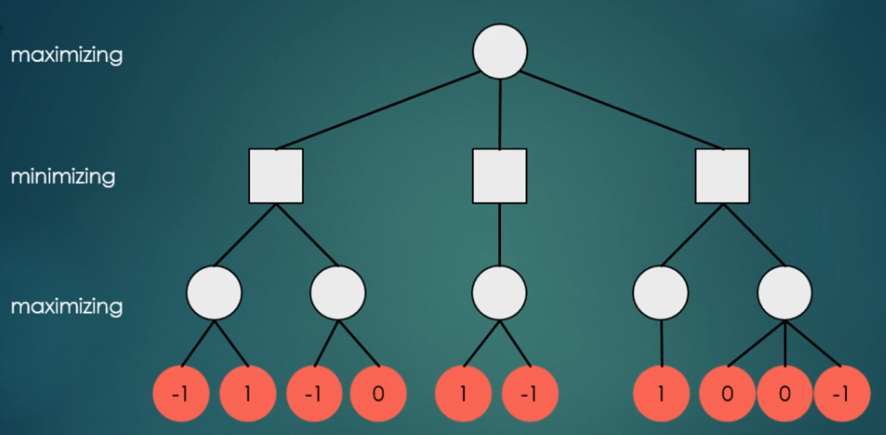

--------
- Leaf node, we choose maximum(-1 vs 1) --> 1

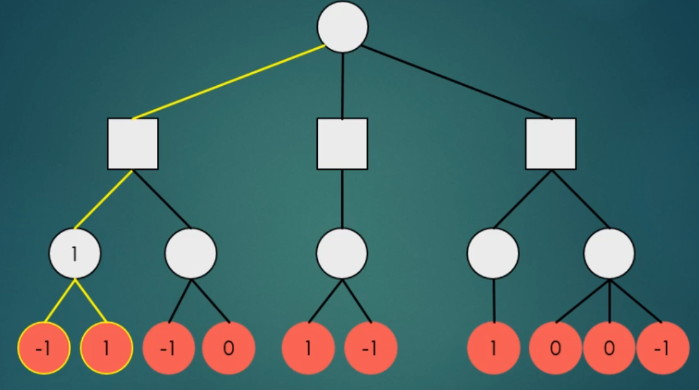

--------
- Leaf node, we choose maximum(-1 vs 0) --> 0

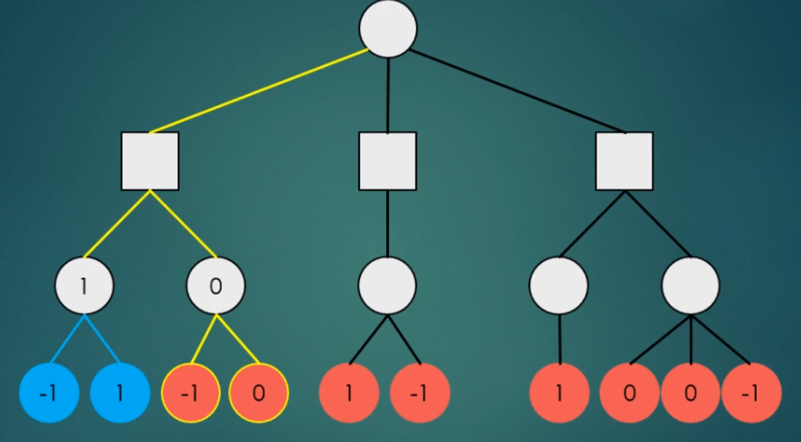

--------
- We choose the mimimum (1 vs 0) --> 0

--------
- And consider this left part of the tree is visited
- Move to the next branch

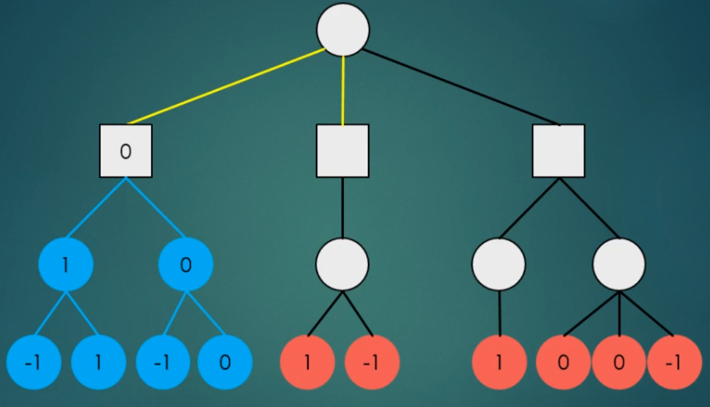

--------
- Leaf node, we choose maximum(1 vs -1) --> 1
- Only a single node --> choose 1

-----
- Same thing

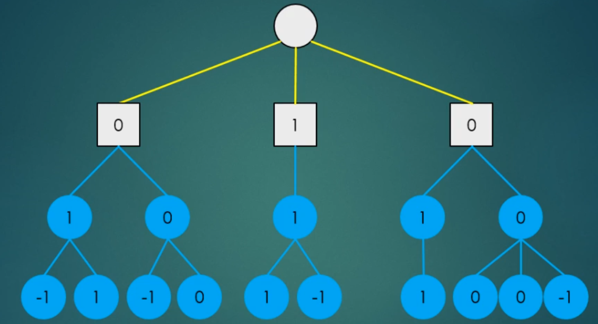

-----
- We have 0, 1 and 0, we choose the maximum --> 1

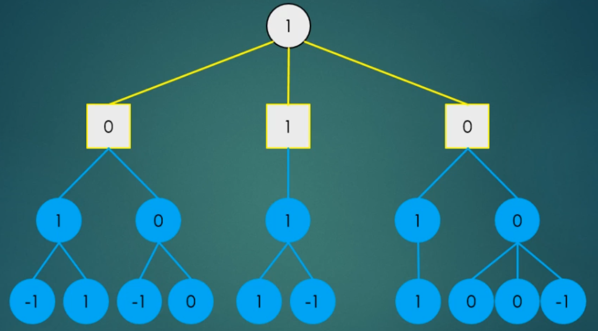

-----

----
- How does it look like?

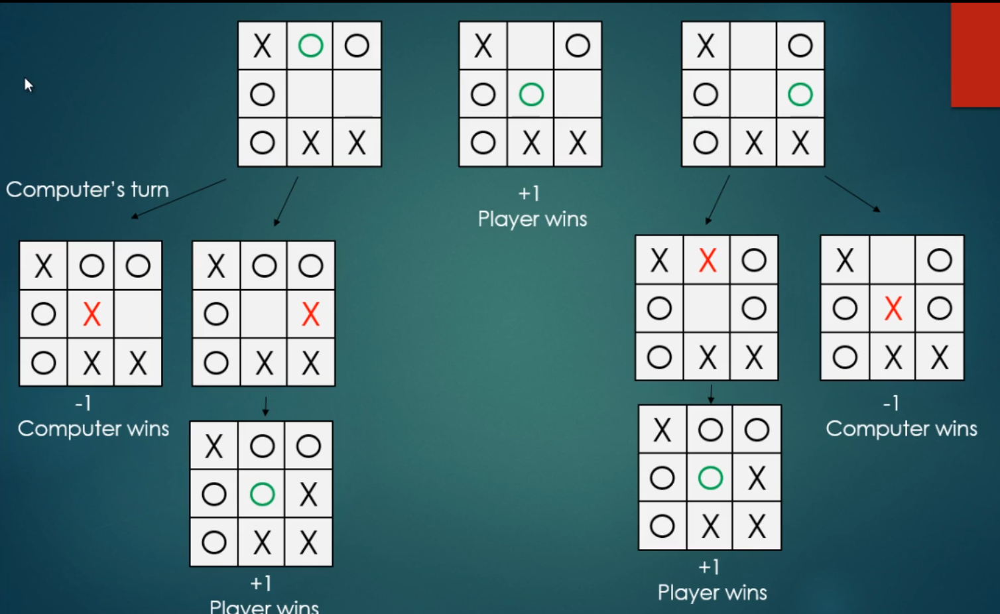

-------

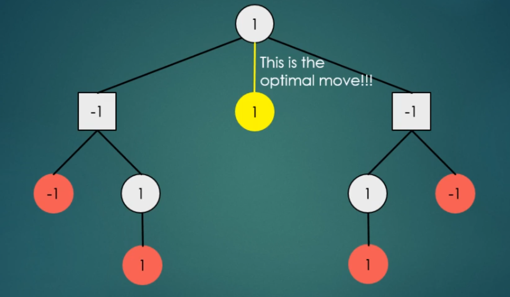

------

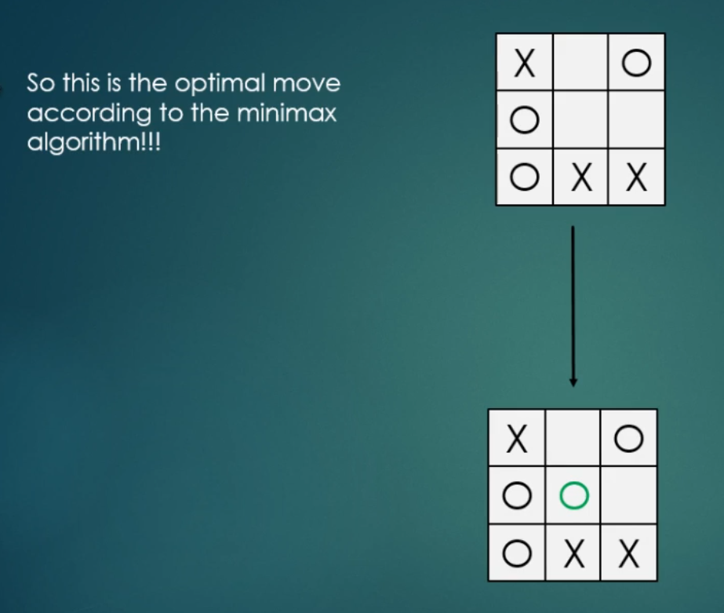

---------

## Pruning

### Alpha-beta pruning
- What is the problem with minimax algorithm ?
- The game tree amy be enormous: there may be some branches we should not visit ....
  - Like there are 2's X on the row, and we should consider to put O in that same row
- These pruning can reduce the time complexity of our minimax algorithm (for example chess)
- Iterative deepening  is usually used in conjunction with alpha-beta so that a reasonably good move can be returned even if the algorithm is interrupted before it has finished execution

-----

-----
- We have to assign two extra variable to every node: alpha and beta
- **Alpha**: best already explored option along path to the root for maximizer
  - Only maximizer nodes can change its value !!! the maximum value the maximizer can receive
    - Initialized to minus infinity
- **Beta**: best already explored option along path to the root for minimizer
  - Only minimizer nodes can change its value !!! The minimum socre the minimizer can receive
    - Initialized to positive infinity
- When alpha is greater or equal to beta -> We can prune that branch !!!

------
- We know that 5 is less than the Beta --> update Beta

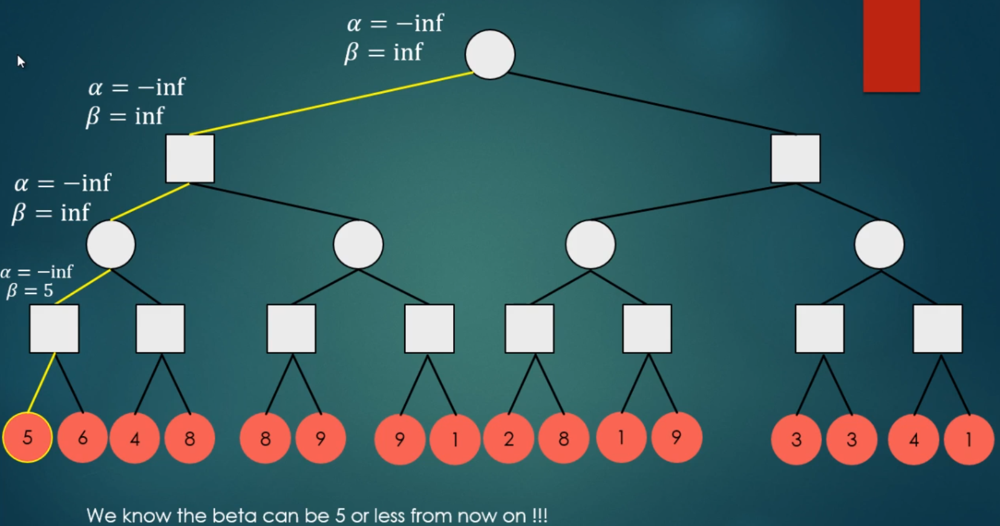

------
- But we see that Alpha is less than Beta --> not able to prune
- --> have to visit the right child (leaf) which is 6
- Because this is the minimizer, that's why the value is going to be 5

-------
- At this state, we want to maximize Alpha
- Because 5 is greater than -inf
- That's why we change value of alpha to 5

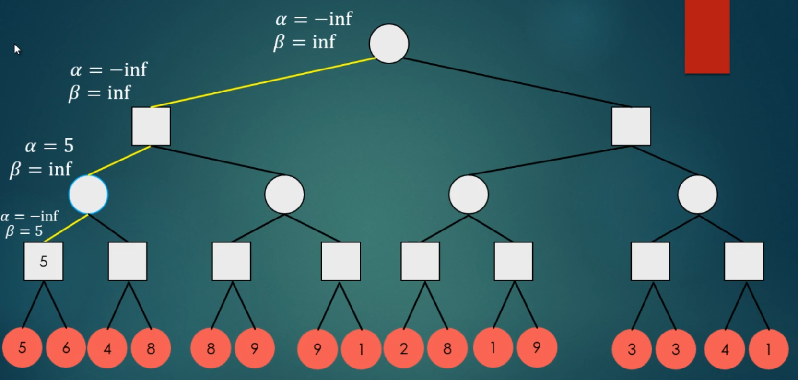

-------
- Go to the right most children
- and because children always inherit Alpha and Beta from the parent
- That's why we have Alpha and Beta here

-------
- Vist child node (leaf) 4
- Since 4 is less than Beta (inf) --> update Beta to 4
- Now, we see that Alpha is greater Beta
- ---> We can prune cause we don't care about right most child

------
- Since 5 is greater than 4 --> choose 5

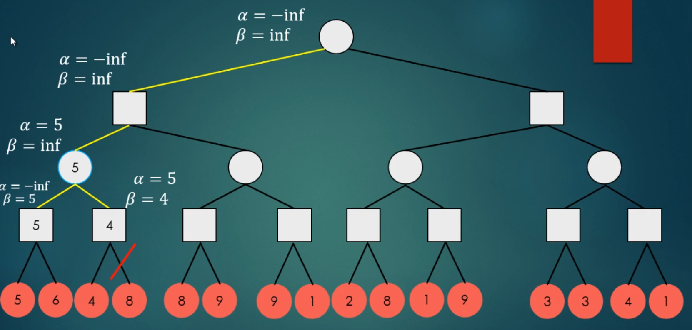

------
- At this state, we want to make Beta as small as possible
- --> inf vs 5 --> update Beta to 5

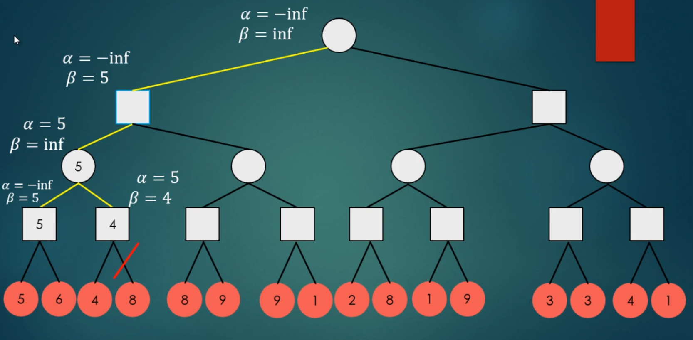

-------
- Because this is the minimize layer
- --> We want Beta to be small as small as possible
- Since 8 > 5 --> no update for Beta
- and 9 > 5 --> no update for Beta
- --> 8 > 9 --> choose 8

-------
- We backtrack
- At this, state, we want to make Alpha as big as possible (maximize layer)
- --> 8 > -inf --> update value of Alpha to 8

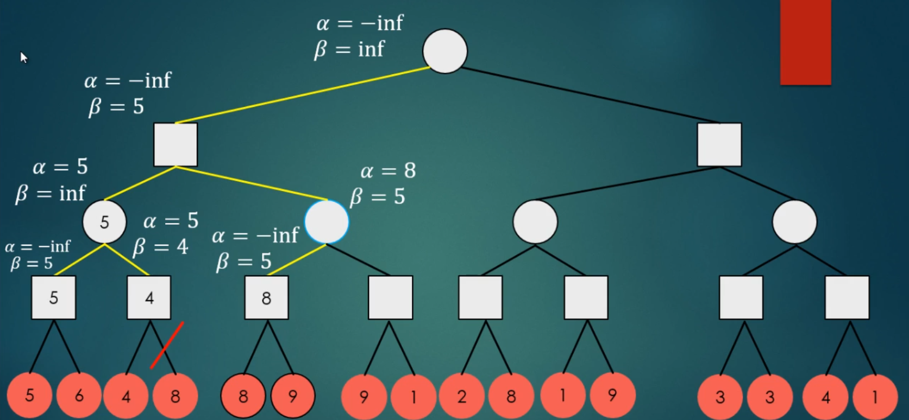

-------
- Since Alpha is greater than Beta ( 8 > 5)
- --> we can prune

-------
- This is the minimum layer
- --> 5 < 8 --> choose 5

-------
- Since root node is the maximize layer --> Alpha as big as possible
- --> 5 > -inf --> 5

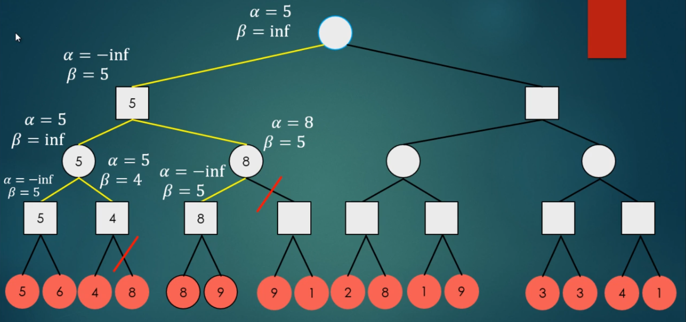

-------
- Same thing for the right children of the root node

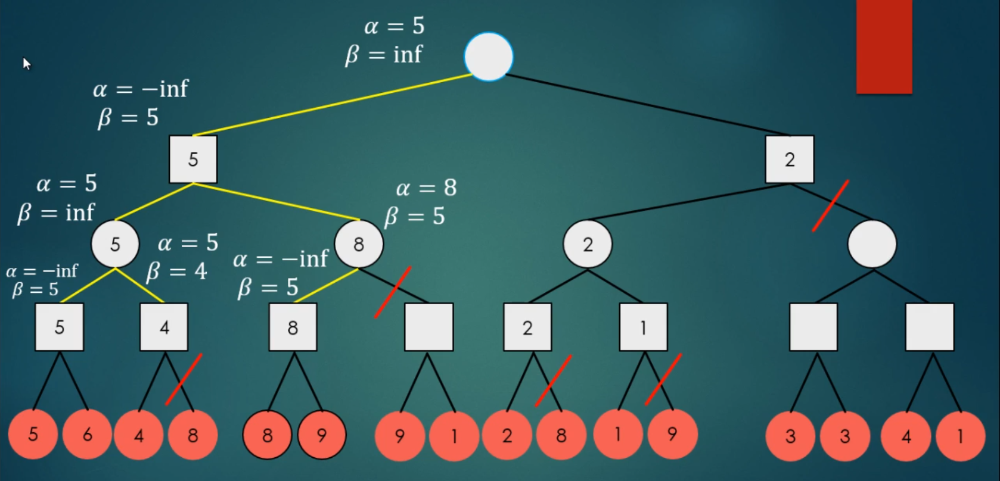

------
- Root node is going to the 5

------
- This is the optimal move!!!

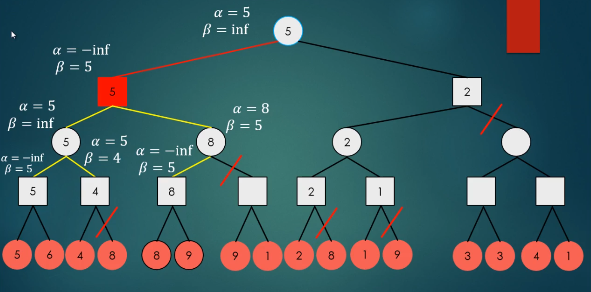
