<link rel="stylesheet" href="https://cdn.jsdelivr.net/github-markdown-css/2.2.1/github-markdown.css"/>

# Maximum Flow
- <u>Flow:</u> **G(V,E)** we have a graph with vertices, and directed edges + in a flow network we have a source and a sink
  - **s**: source -> flow coming from the source // posotive divergence
  - **t**: sink -> flow heading for the sink // negative divergence

- For example: Flow of water in pipes OR flow of cars in the traffic, wherer edges are the streets / roads
    - We assign a capaccity to every edge: that's the maximum flow to that given edge (pipe or road)
    - We assign a flow value to every edge: the actual flow
      - For example: 10 gallon of water / seconds -> that's a flow !!!

-------
- <u>Paramter:</u> **flow/capacity**, ex: 0/10, 0/5, 0/15 ,...

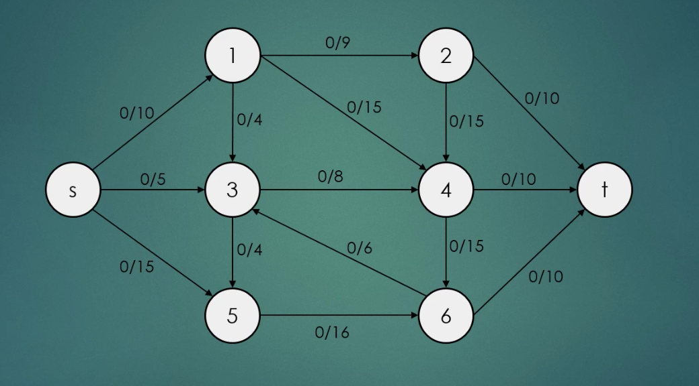

- What is the aim?
  - **Given a flow network G(V,E), find the flow with maximum value from source to sink!!!**

--------

## Flow network properties

1. **<u>Capacity constraint:</u>** for all **u, v** vertices in **V  ,  f(u,v) <= c(u,v)**
    - So the flow can not be greater than the capacity!!!
2. **<u>Flow Conservation:</u>** For all v vertices in **V** (except for **s** and **t**), the flow income must be equal to the outgoing flow // div = 0

      - 

3. **<u>Skew symmetry:</u>** It is important when we want to prove the lemmas and theorems
    - For all **u, v** vertices in **V    , f(u,v) = - f(v,u)**

4. Flow constraints: The flow leaving from s must be euqal to the flow arriving at **t**
    - 

    - 

    - 

    - 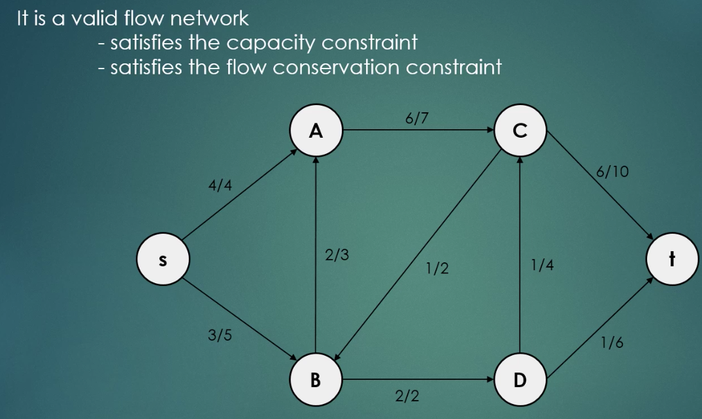

    - 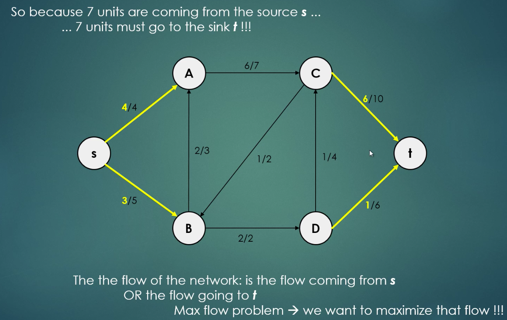

---------

## CUTs
- A cut **(S,T)** of a **flow network G(V,E)** is a partition of vertices such that every vertex will **belong** to **either** **S** or **T**

    - 

    - 

    - 

- **Flow accorss the cut:** we add up all flows going from one set of vertices to the other (from **S** to **T**)

    - 

    - 

    - 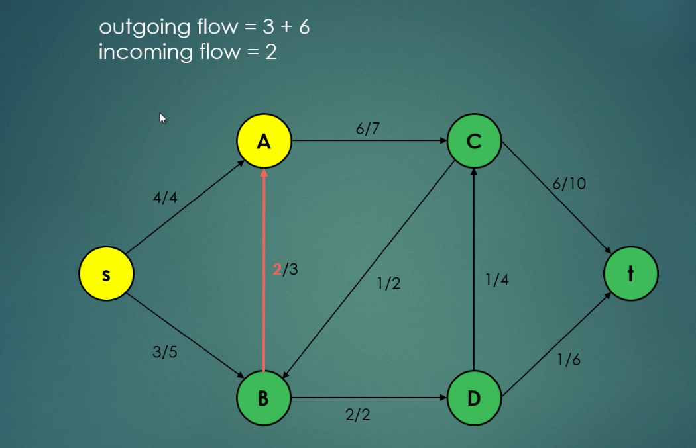

    - 

    - 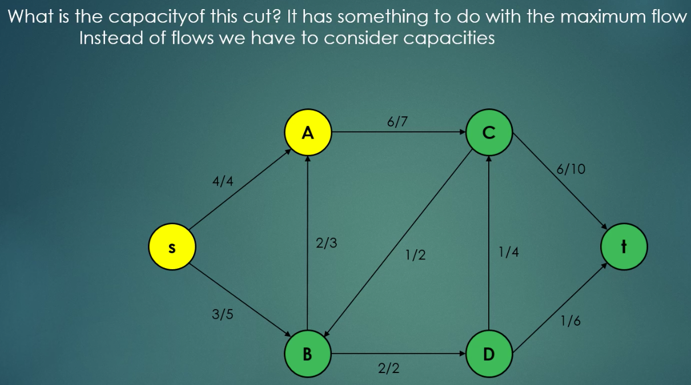

    - 

    - 

    - 

#### <u>Max flow - min cut Theorem</u>

- The value of any flow is bounded by the capacity of any cut
- So **the maximum flow and the minimum cut has something to do with each other**
- Precisely -> the value of the maximum flow passing from source **s** to sink **t** is equal to the value of the minimum cut (so the total weight of edges in the minimum cut)
- Another important fact: the minimum cut is the smallest total weight of the edges which if removed would disconnect he source from the sink

### <u>Residual network</u>

- 

- 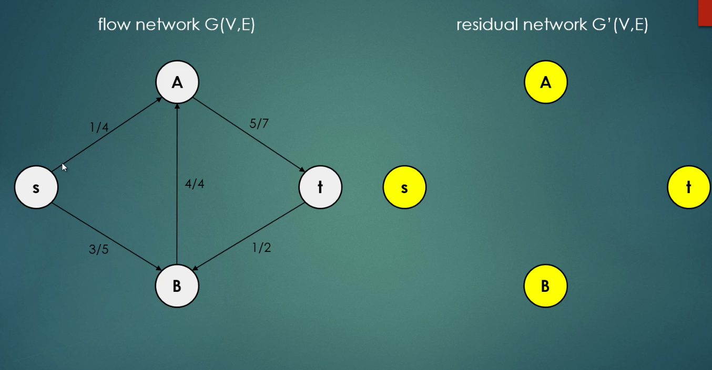

- 

- 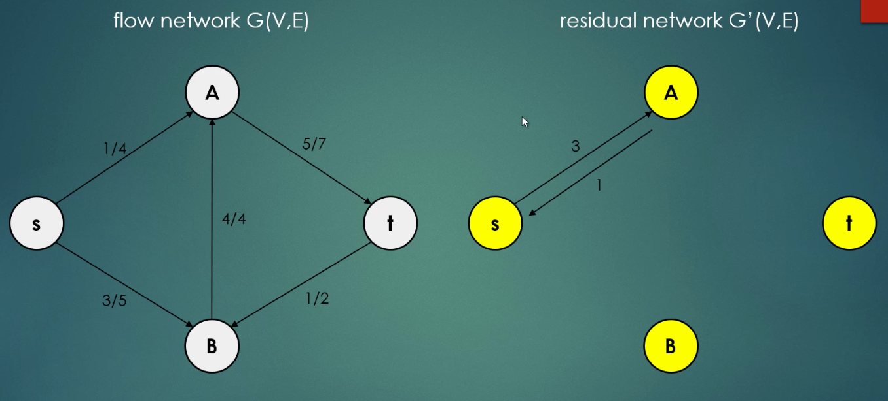

- 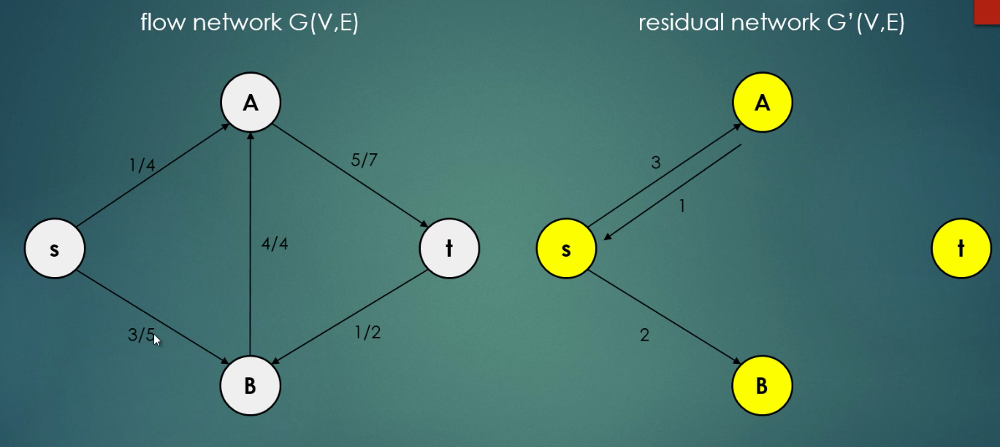

- 
------

- Send 4 from B to A, --> no more flow left

- 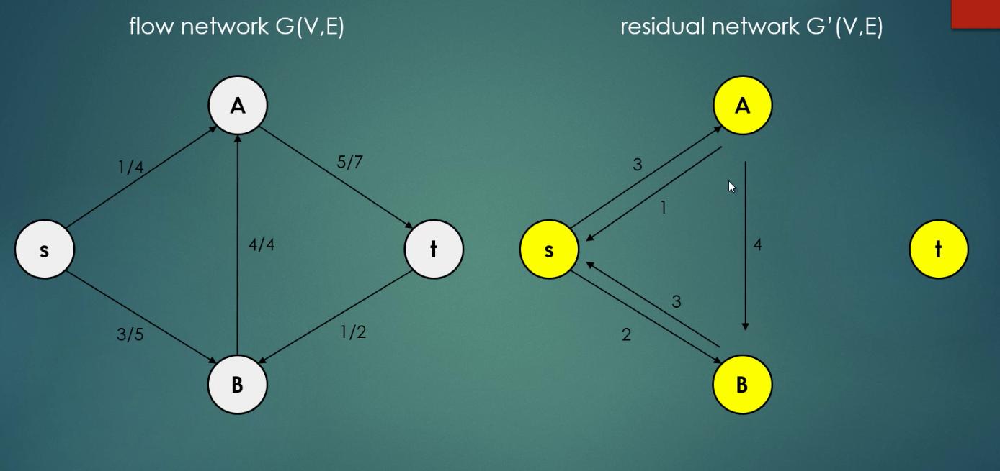

- ... Same thing

- 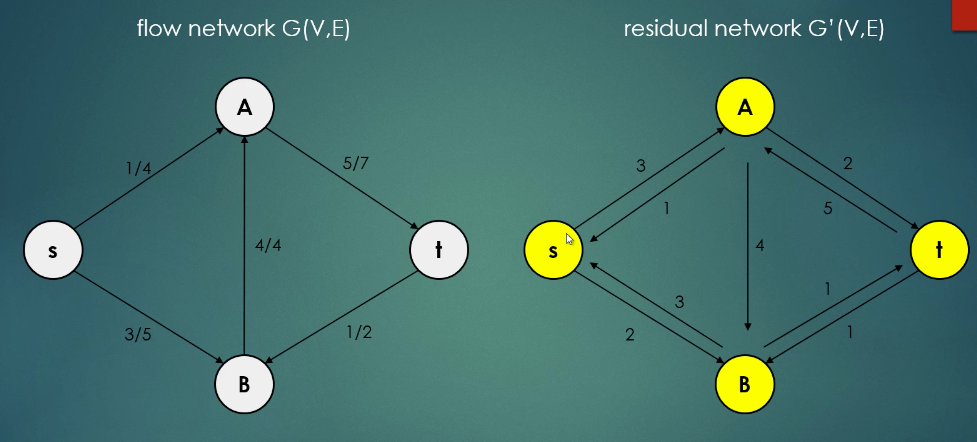

-------

## Ford-Fulkerson algorithm

- <u>Augmenting path</u>: it only exists in the residual **G'(V,E)** network
  - It is a simple path from **s** to **t** in the residual network

  - **If there is an augmenting path in **G'** we know for certain that the flow in **G** is not maximal**
  - **If there is no more augmentingpaths in **G'**, it means we can terminate the algorithm**

#### Steps:
1. Initialize the flow in the flow network to be zero at the beginning
    - **f(u,v) <-- 0 for all u,v in V**
2. While there is a path from **s** to **t** in **G'** residual network
    - Find that given augmenting path **p**
    - Do augment **f** flow along path **p** in the **G** flow network

-----

## Edmonds-Karp algorithm
- We know from Ford-Fulkerson algorithm that we have to find the augmentingn paths in the residual network
- There are several graph traversal algorithms to traverse a graph
- Edmons-Karp algorithm -> uses **BFS** (breadth-first search) to find these augmenting paths
- **Running time of Edmonds-Karp:** **O(V E^2)**
- **Running time of Dubuc algorithm:** **O(V^2 E)** <-- better if **E > V**

#### Steps:

- **Initilize every flow to be 0**
- At the begining, the **residual G' is the same as Original G(V,E) graph**

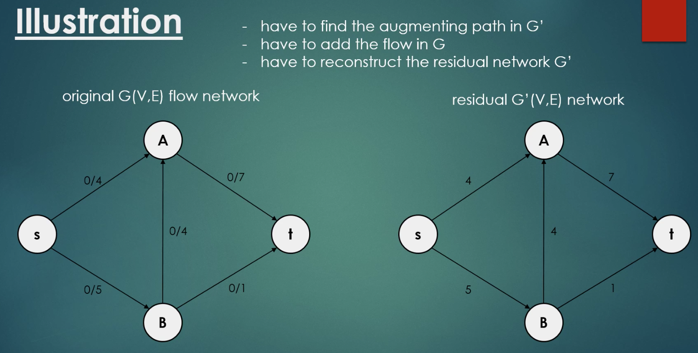

-----

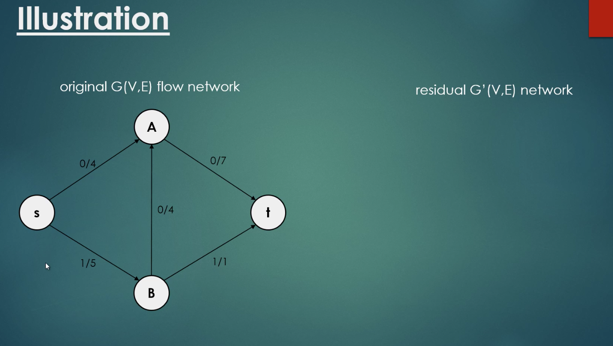

-----
- We have to find the **Shortest augmenting path**
-  S -> B -> A -> T with cost 11

---

-----
- Add flow 3 to graph G:
  - S -- B = 1 + 3 = 4
  - B -- A = 0 + 3 = 3
  - A -- T = 4 + 3 = 7

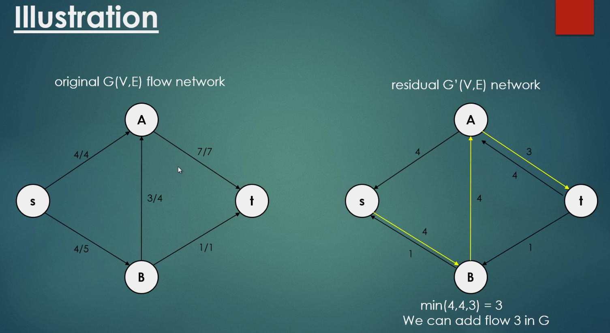

--------
- **Let's Construct the Residual G' network again**
- **Then, as you can see, we have 2 back edges comming out to T**
  - **--> Can't get from S to T**
  - **---> NO MORE AUGMENTING PATH !!!**
  - **---> This is the end of the Algorithm**

------
- What is the maximum flow? 4 + 4 = 8 (outgoing and comming)

------
- What is the minimum cut? Basically equal to the maximum flow

-----
- We consider edge S -- A(4/4), but it's full (4/4)
- We consider edge S -- B (4/5)
- --> visit B
- We consider edge B -- T (1/1), but it's full (1/1)
- We consider edge B -- A (3/4)
- --> visit A
- We consider edge A -- T (7/7), but it's full (7/7)

-------

- Therefore, we have 2 two (Yellow and green)
- The minimum cut is the flow from Yellow set to Green set
- In this case flow from A to T (7) and B to T (1)
- **Minimum cut: 7+1 = 8**

