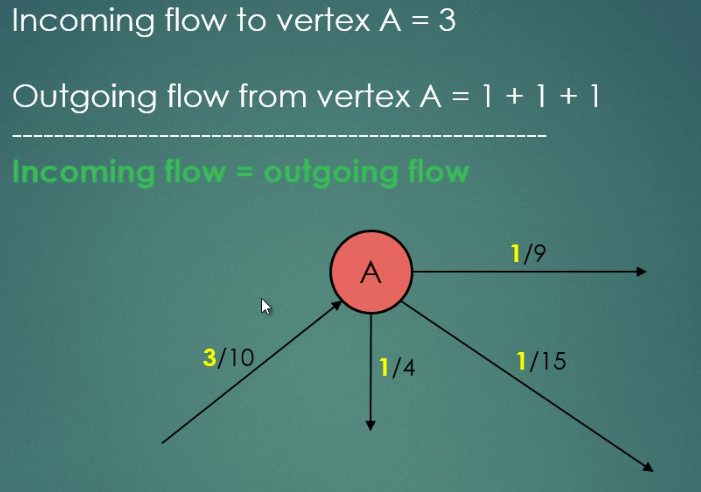
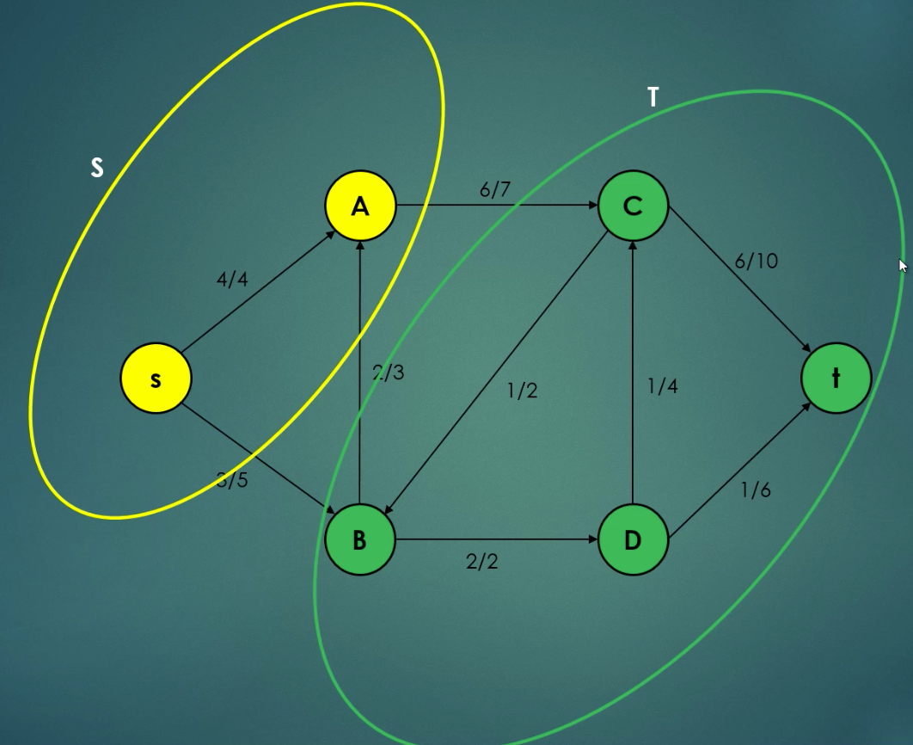
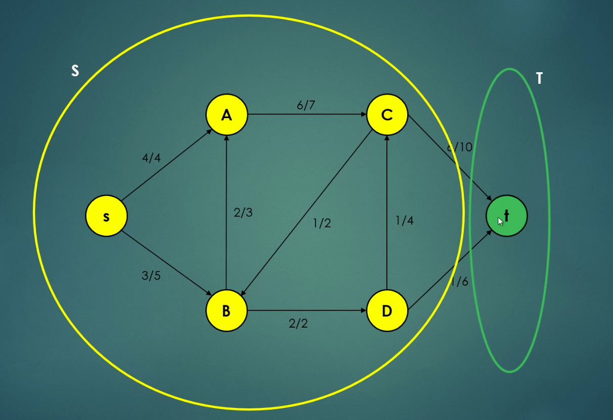
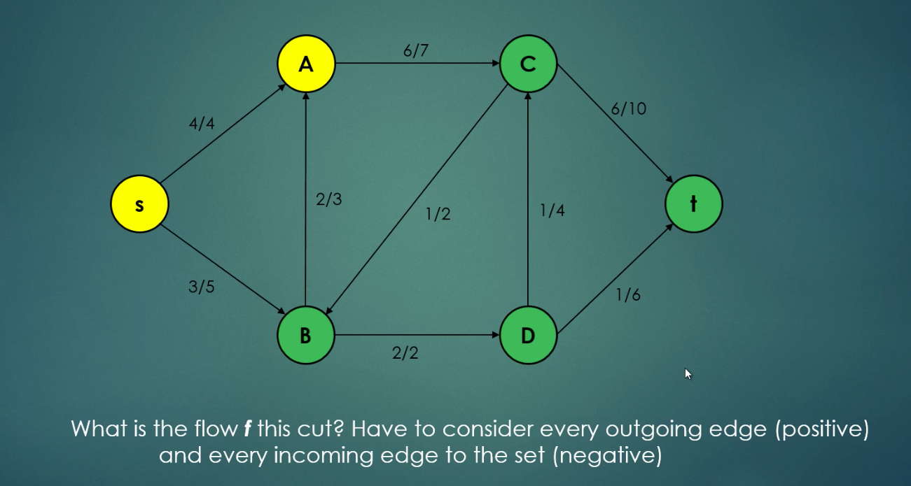
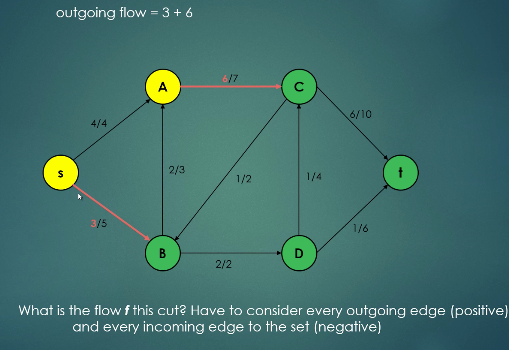
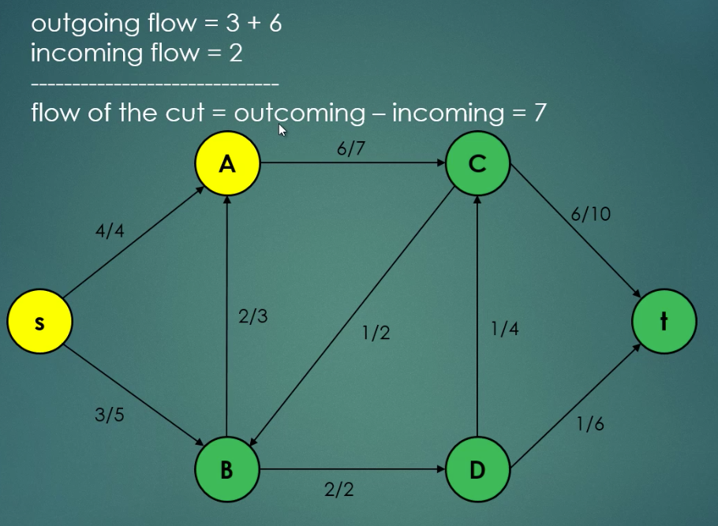
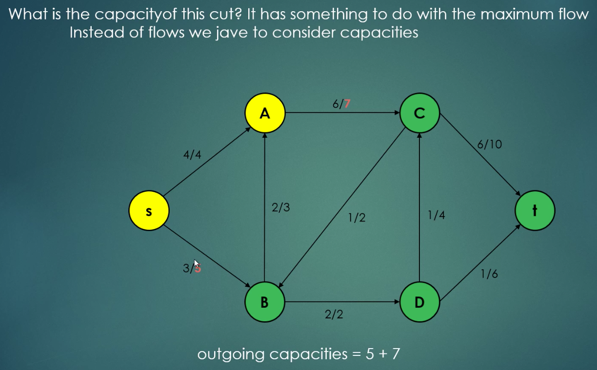

<link rel="stylesheet" href="https://cdn.jsdelivr.net/github-markdown-css/2.2.1/github-markdown.css"/>

# Maximum Flow
- <u>Flow:</u> **G(V,E)** we have a graph with vertices, and directed edges + in a flow network we have a source and a sink
  - **s**: source -> flow coming from the source // posotive divergence
  - **t**: sink -> flow heading for the sink // negative divergence

- For example: Flow of water in pipes OR flow of cars in the traffic, wherer edges are the streets / roads
    - We assign a capaccity to every edge: that's the maximum flow to that given edge (pipe or road)
    - We assign a flow value to every edge: the actual flow
      - For example: 10 gallon of water / seconds -> that's a flow !!!

-------
- <u>Paramter:</u> **flow/capacity**, ex: 0/10, 0/5, 0/15 ,...

- What is the aim?
  - **Given a flow network G(V,E), find the flow with maximum value from source to sink!!!**

--------

## Flow network properties

1. **<u>Capacity constraint:</u>** for all **u, v** vertices in **V  ,  f(u,v) <= c(u,v)**
    - So the flow can not be greater than the capacity!!!
2. **<u>Flow Conservation:</u>** For all v vertices in **V** (except for **s** and **t**), the flow income must be equal to the outgoing flow // div = 0

      - 

3. **<u>Skew symmetry:</u>** It is important when we want to prove the lemmas and theorems
    - For all **u, v** vertices in **V    , f(u,v) = - f(v,u)**

4. Flow constraints: The flow leaving from s must be euqal to the flow arriving at **t**
    - 

    - 

    - 

    - 

    - 

---------

## CUTs
- A cut **(S,T)** of a **flow network G(V,E)** is a partition of vertices such that every vertex will **belong** to **either** **S** or **T**

    - 

    - 

    - 

- **Flow accorss the cut:** we add up all flows going from one set of vertices to the other (from **S** to **T**)

    - 

    - 

    - 

    - 

    - 

    - 

    - 

    - 

#### <u>Max flow - min cut Theorem</u>

- The value of any flow is bounded by the capacity of any cut
- So **the maximum flow and the minimum cut has something to do with each other**
- Precisely -> the value of the maximum flow passing from source **s** to sink **t** is equal to the value of the minimum cut (so the total weight of edges in the minimum cut)
- Another important fact: the minimum cut is the smallest total weight of the edges which if removed would disconnect he source from the sink
