<link rel="stylesheet" href="https://cdn.jsdelivr.net/github-markdown-css/2.2.1/github-markdown.css"/>

# Maximum Flow
- <u>Flow:</u> **G(V,E)** we have a graph with vertices, and directed edges + in a flow network we have a source and a sink
  - **s**: source -> flow coming from the source // posotive divergence
  - **t**: sink -> flow heading for the sink // negative divergence

- For example: Flow of water in pipes OR flow of cars in the traffic, wherer edges are the streets / roads
    - We assign a capaccity to every edge: that's the maximum flow to that given edge (pipe or road)
    - We assign a flow value to every edge: the actual flow
      - For example: 10 gallon of water / seconds -> that's a flow !!!


-------
- <u>Paramter:</u> **flow/capacity**, ex: 0/10, 0/5, 0/15 ,...


- What is the aim?
  - **Given a flow network G(V,E), find the flow with maximum value from source to sink!!!**

--------

## Flow network properties

1. **<u>Capacity constraint:</u>** for all **u, v** vertices in **V  ,  f(u,v) <= c(u,v)**
    - So the flow can not be greater than the capacity!!!
2. **<u>Flow Conservation:</u>** For all v vertices in **V** (except for **s** and **t**), the flow income must be equal to the outgoing flow // div = 0

      - 

3. **<u>Skew symmetry:</u>** It is important when we want to prove the lemmas and theorems
    - For all **u, v** vertices in **V    , f(u,v) = - f(v,u)**

4. Flow constraints: The flow leaving from s must be euqal to the flow arriving at **t**
    - 

    - 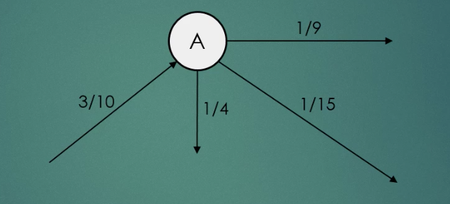

    - 

    - 

    - 

---------

## CUTs
- A cut **(S,T)** of a **flow network G(V,E)** is a partition of vertices such that every vertex will **belong** to **either** **S** or **T**

    - 

    - 

    - 

- **Flow accorss the cut:** we add up all flows going from one set of vertices to the other (from **S** to **T**)

    - 

    - 

    - 

    - 

    - 

    - 

    - 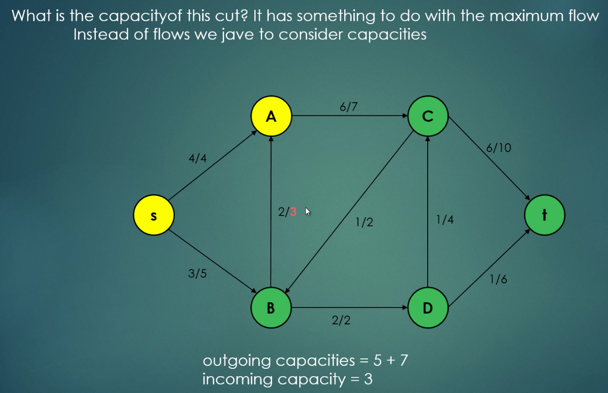

    - 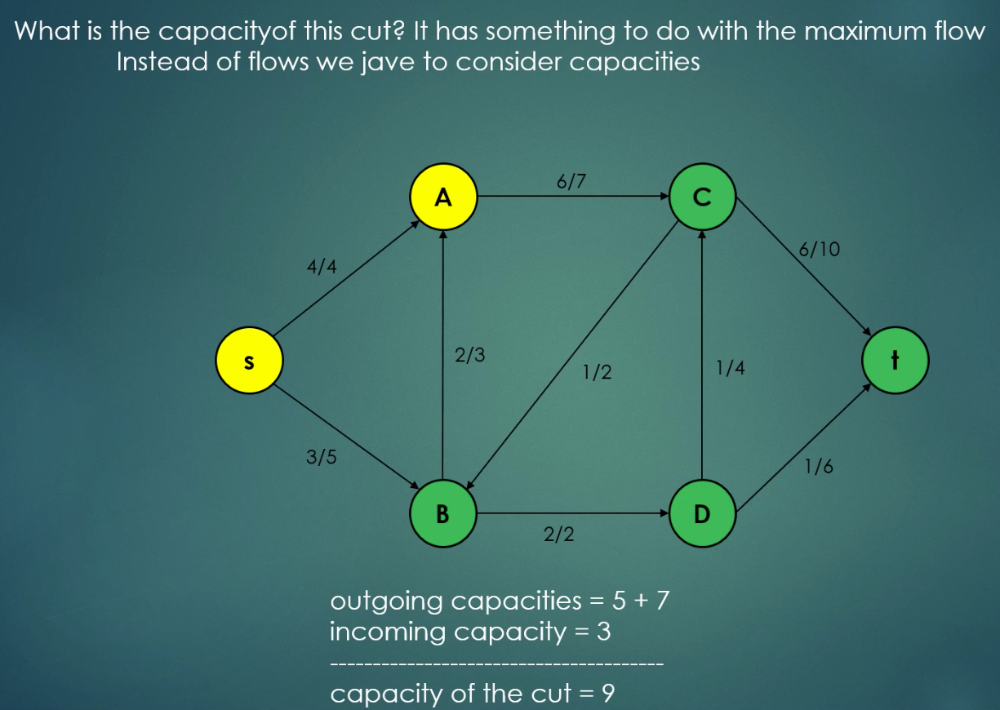


#### <u>Max flow - min cut Theorem</u>

- The value of any flow is bounded by the capacity of any cut
- So **the maximum flow and the minimum cut has something to do with each other**
- Precisely -> the value of the maximum flow passing from source **s** to sink **t** is equal to the value of the minimum cut (so the total weight of edges in the minimum cut)
- Another important fact: the minimum cut is the smallest total weight of the edges which if removed would disconnect he source from the sink

### <u>Residual network</u>

- 

- 

- 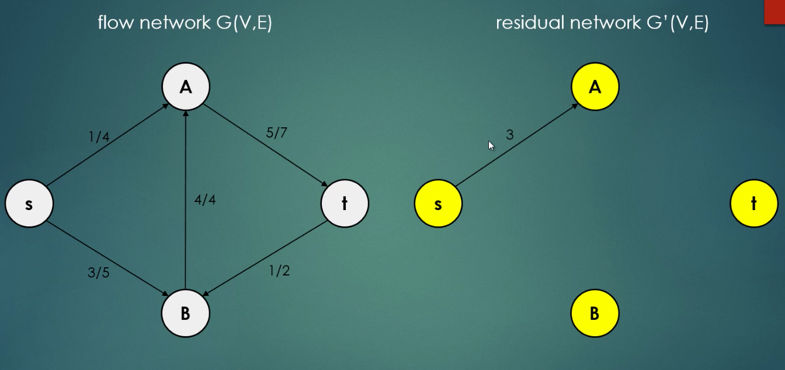

- 

- 

- 
------

- Send 4 from B to A, --> no more flow left

- 

- ... Same thing

- 

-------

## Ford-Fulkerson algorithm

- <u>Augmenting path</u>: it only exists in the residual **G'(V,E)** network
  - It is a simple path from **s** to **t** in the residual network

  - **If there is an augmenting path in **G'** we know for certain that the flow in **G** is not maximal**
  - **If there is no more augmentingpaths in **G'**, it means we can terminate the algorithm**

#### Steps:
1. Initialize the flow in the flow network to be zero at the beginning
    - **f(u,v) <-- 0 for all u,v in V**
2. While there is a path from **s** to **t** in **G'** residual network
    - Find that given augmenting path **p**
    - Do augment **f** flow along path **p** in the **G** flow network

-----

## Edmonds-Karp algorithm
- We know from Ford-Fulkerson algorithm that we have to find the augmentingn paths in the residual network
- There are several graph traversal algorithms to traverse a graph
- Edmons-Karp algorithm -> uses **BFS** (breadth-first search) to find these augmenting paths
- **Running time of Edmonds-Karp:** **O(V E^2)**
- **Running time of Dubuc algorithm:** **O(V^2 E)** <-- better if **E > V**

#### Steps:

- **Initilize every flow to be 0**
- At the begining, the **residual G' is the same as Original G(V,E) graph**


-----

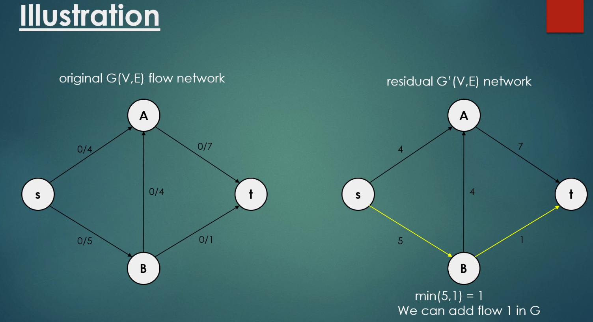


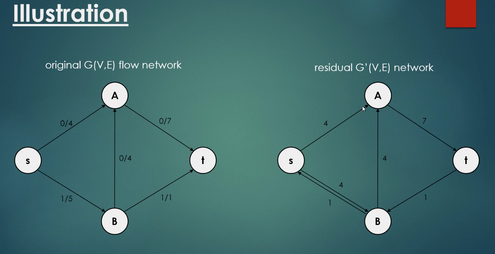


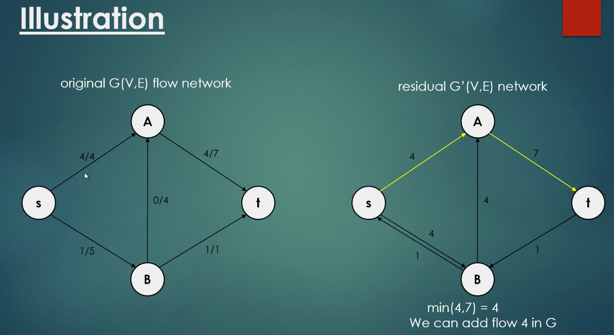

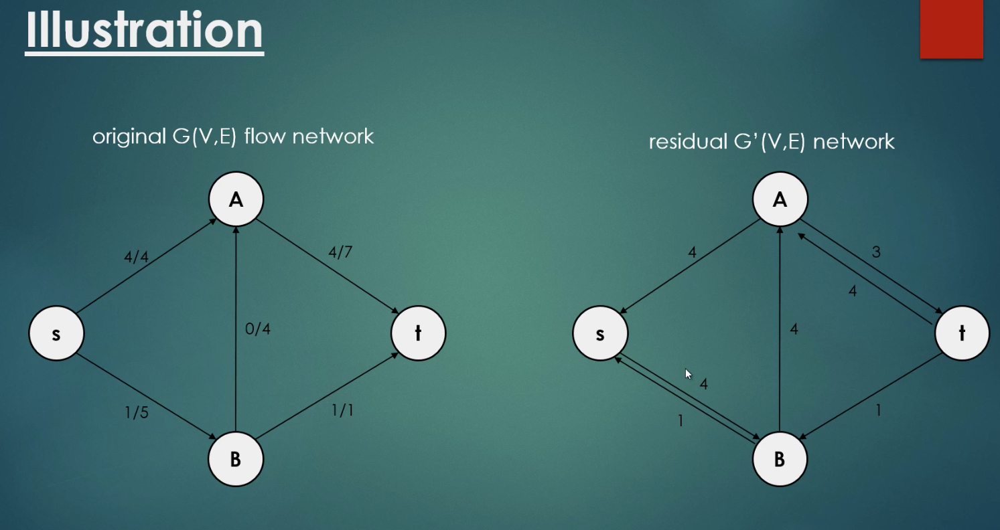

-----
- We have to find the **Shortest augmenting path**
-  S -> B -> A -> T with cost 11


---

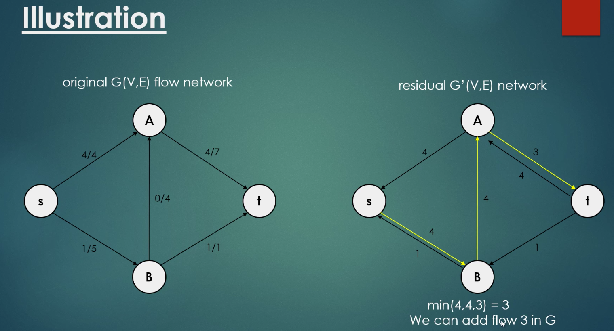

-----
- Add flow 3 to graph G:
  - S -- B = 1 + 3 = 4
  - B -- A = 0 + 3 = 3
  - A -- T = 4 + 3 = 7


--------
- **Let's Construct the Residual G' network again**
- **Then, as you can see, we have 2 back edges comming out to T**
  - **--> Can't get from S to T**
  - **---> NO MORE AUGMENTING PATH !!!**
  - **---> This is the end of the Algorithm**

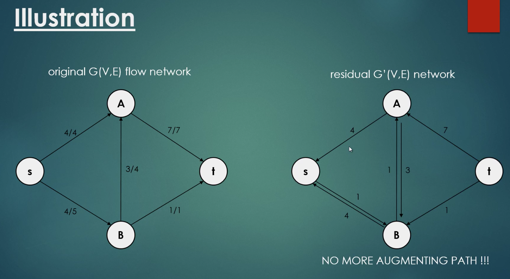

------
- What is the maximum flow? 4 + 4 = 8 (outgoing and comming)

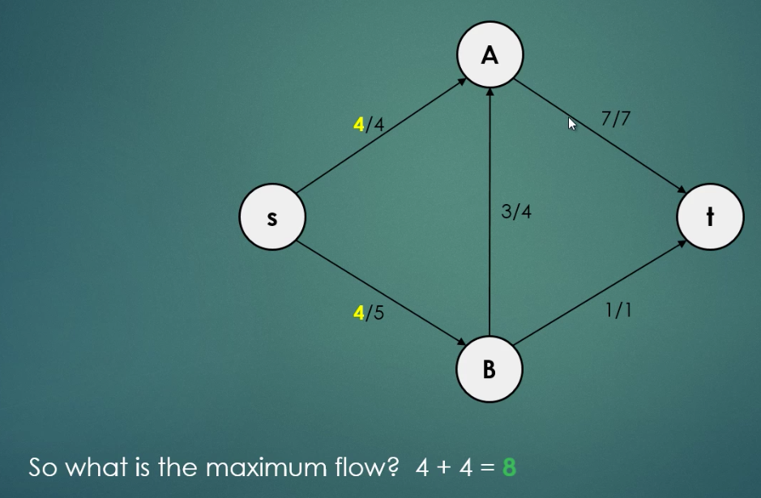


------
- What is the minimum cut? Basically equal to the maximum flow

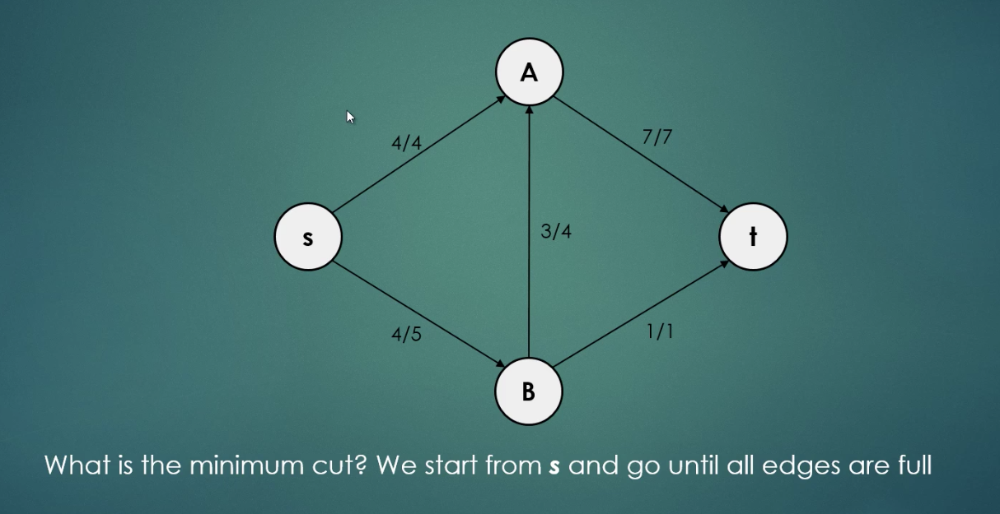

-----
- We consider edge S -- A(4/4), but it's full (4/4)
- We consider edge S -- B (4/5)
- --> visit B
- We consider edge B -- T (1/1), but it's full (1/1)
- We consider edge B -- A (3/4)
- --> visit A
- We consider edge A -- T (7/7), but it's full (7/7)

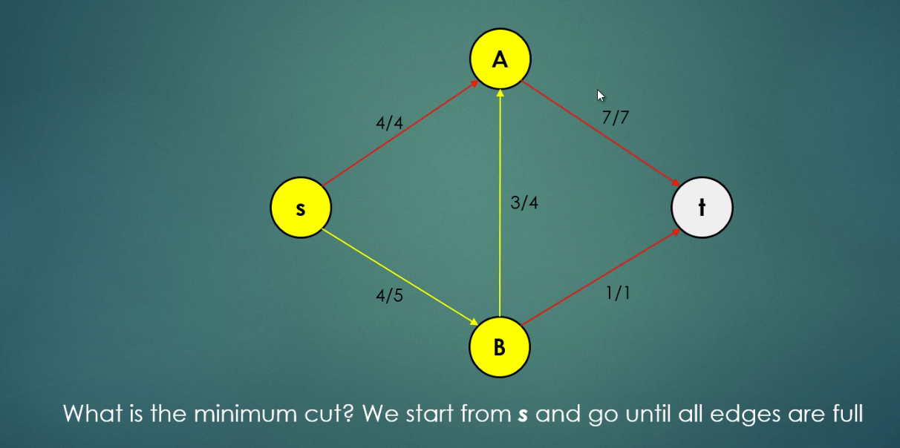

-------

- Therefore, we have 2 two (Yellow and green)
- The minimum cut is the flow from Yellow set to Green set
- In this case flow from A to T (7) and B to T (1)
- **Minimum cut: 7+1 = 8**

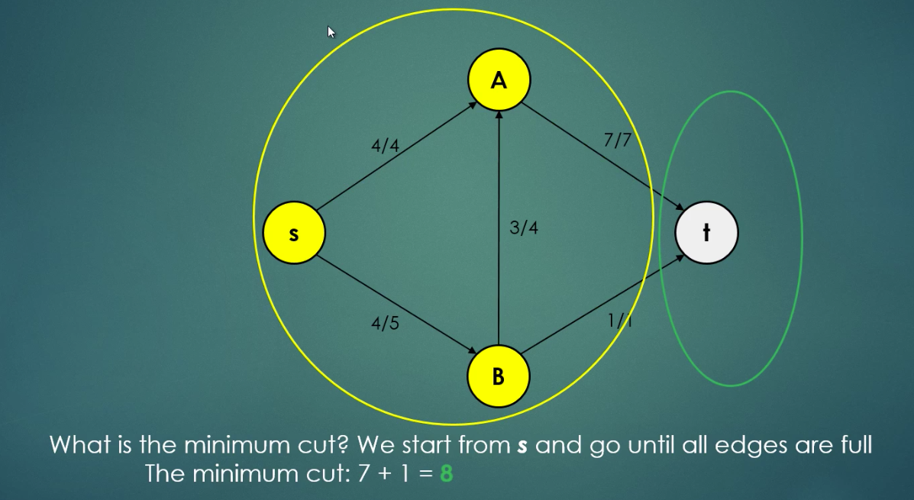


------

## Applications
- A commumnications network has a set of requests to transmit messages between servers that are connected by channels (abstract wires)
- They are capable of trnaferring information at varying rates
- What is the maximum rate at which information can be transferred between two specified servers in the network?
- If they are costs associated with the channels, what is the cheapest way to send the information at a given rate that is less than the maximum?

----

- Suppose that we have **N students** each needing jobs
- There are **N companies** each needing to hire a student
- These two lists (one sorted by student, the other sorted by company) give a list of job offers, which indicate mutual interest in matching students and jobs
- Is there some way to match students to jobs so that every jobs is filled and every student gets a job?
- If not, what is the maximum number of jobs that can be filled?

-----

- A city government needs to formulate a plan for evacuating people from the city in an emergency
- What is the minimum amount of time that it would take to evacuate the city, if we suppose that we can control traffic flow so as to realize the minimum?
- Traffic planners also might formulate questions like this when deciding which new roads, bridges, or tunnels might alleviate in rush-hours

----

- Given roads connecting an army's supply depot from troops at the bottom
- Make bombing plan that would separate troops from supplies
- The enemy's goal is to minimize the cost of bombing (perhaps assuming that the cost of cutting an ege is proportional to its width)
- The army's goal is to design its road network to maximize the enemy's minimum cost

-------

### Implementation

```java
public class Vertex {

  private int id;
  private String name;
  private boolean visited;

  public Vertex(int id, String name) {
    this.id = id;
    this.name = name;
  }

  public int getId(){ return id; }
  public void setId(int id) { this.id = id; }

  public String getName(){ return name; }
  public void setName(String name) { this.name = name; }

  public boolean getVisited(){ return visited; }
  public void setVisited(boolean visited) { this.visited = visited; }

  public String toString() {
    return this.id + " " + this.name;
  }
}
```

```java
public class Edge {

  private Vertex fromVertex;
  private Vertex targetVertex;
  private final double capacity;
  private double flow;

  public Edge(Vertex fromVertex, Vertex targetVertex, double capacity) {
    this.fromVertex = fromVertex;
    this.targetVertex = targetVertex;
    this.capacity = capacity;
    this.flow = 0.0;
  }

  public Edge(Edge edge) {
    this.fromVertex = edge.getFromVertex();
    this.targetVertex = edge.getTargetVertex();
    this.capacity = edge.getCapacity();
    this.flow = edge.getFlow();
  }

  public Vertex getOther(Vertex vertex) {
    return (vertex == fromVertex) ? targetVertex : fromVertex;
  }

  public double getResidualCapacity(Vertex vertex) {
    return (vertex == fromVertex) ? flow : (capacity - flow);
  }        // Backward edge                 // forward edge

  public void addResidualFlowto(Vertex vertex, double deltaFlow) {
    flow = (vertex == fromVertex) ? (flow - deltaFlow) : (flow + deltaFlow);
  }         // backward edge                              // forward edge

  public double getFlow() { return flow; }
  public void setFlow(double flow) { this.flow = flow; }

  public double getCapacity() { return capacity; }

  public Vertex getFromVertex() { return fromVertex; }
  public void setFromVertex(Vertex fromVertex) { this.fromVertex = fromVertex; }

  public Vertex getTargetVertex() { return targetVertex; }
  public void setTargetVertex(Vertex targetVertex) { this.targetVertex = targetVertex; }

  @Override
  public String toString() { return fromVertex + "-" + targetVertex + " " + flow + "/" + capacity; }
}
```

```java
import java.util.ArrayList;
import java.util.List;

public class FlowNetwork {

  private int numOfVertices;
  private int numOfEdges;
  private List<List<Edge>> adjacenciesList;

  public FlowNetwork(int numOfVertices) {
    this.numOfVertices = numOfVertices;
    this.numOfEdges = 0;
    this.adjacenciesList = new ArrayList<>();

    for(int i = 0; i < numOfVertices; i++) {
      List<Edge> edgeList = new ArrayList<>();
      adjacenciesList.add(edgeList);
    }
  }

  public int getNumOfVertices() { return numOfVertices; }
  public int getNumOfEdges() { return numOfEdges; }

  public void addEdge(Edge e) {
    Vertex v = e.getFromVertex();
    Vertex w = e.getTargetVertex();
    adjacenciesList.get(v.getId()).add(e);
    adjacenciesList.get(w.getId()).add(e);
    numOfEdges++;
  }

  public List<Edge> getAdjacenciesList(Vertex v) { return adjacenciesList.get(v.getId()); }

}
```

```java
import java.util.LinkedList;
import java.util.Queue;
import java.util.ArrayList;
import java.util.List;

public class FordFulkerson {

  // marked[v.getId()] = true s --> v in the residual graph
  private boolean[] marked;
  private Edge[] edgeTo; // edgeTo[v] = edges in the augmenting path
  private double valueMaxFlow;

  public FordFulkerson(FlowNetwork flowNetwork, Vertex s, Vertex t) {

    while(hasAugmentingPath(flowNetwork, s, t)) {
      double minValue = Double.POSITIVE_INFINITY;

      for(Vertex v = t; v != s; v = edgeTo[v.getId()].getOther(v)) {
        minValue = Math.min(minValue, edgeTo[v.getId()].getResidualCapacity(v) );
      }

      for(Vertex v = t; v != s; v = edgeTo[v.getId()].getOther(v)) {
        edgeTo[v.getId()].addResidualFlowto(v, minValue);
      }

      valueMaxFlow = valueMaxFlow + minValue;
    }
  }

  public boolean isInCut(int index) { return marked[index]; }

  public double getMaxFlow() { return this.valueMaxFlow; }

  // BFS
  private boolean hasAugmentingPath(FlowNetwork flowNetwork, Vertex s, Vertex t) {
    edgeTo = new Edge[flowNetwork.getNumOfVertices()];
    marked = new boolean[flowNetwork.getNumOfVertices()];

    Queue<Vertex> queue = new LinkedList<>();
    queue.add(s);
    marked[s.getId()] = true;

    while(!queue.isEmpty() && !marked[t.getId()]) {
      Vertex v = queue.remove();

      for(Edge e : flowNetwork.getAdjacenciesList(v)) {
        Vertex w = e.getOther(v);

        if(e.getResidualCapacity(w) > 0) {
          if(!marked[w.getId()]) {
            edgeTo[w.getId()] = e;
            marked[w.getId()] = true;
            queue.add(w);
          }
        }
      }
    }

    // true means there is an augmenting path from s to t
    return marked[t.getId()];
  }

  public static void main(String[] args) {

  	FlowNetwork flowNetwork = new FlowNetwork(4);

  	Vertex vertex0 = new Vertex(0, "s");
  	Vertex vertex1 = new Vertex(1, "A");
  	Vertex vertex2 = new Vertex(2, "B");
  	Vertex vertex3 = new Vertex(3, "t");

  	List<Vertex> vertexList = new ArrayList<>();
  	vertexList.add(vertex0);
  	vertexList.add(vertex1);
  	vertexList.add(vertex2);
  	vertexList.add(vertex3);

  	flowNetwork.addEdge(new Edge(vertex0, vertex1, 4));
  	flowNetwork.addEdge(new Edge(vertex0, vertex2, 5));

  	flowNetwork.addEdge(new Edge(vertex1, vertex3, 7));

  	flowNetwork.addEdge(new Edge(vertex2, vertex1, 4));
  	flowNetwork.addEdge(new Edge(vertex2, vertex3, 1));

  	FordFulkerson fordFulkerson = new FordFulkerson(flowNetwork, vertex0, vertex3);

  	System.out.println("Maximum flow is: " + fordFulkerson.getMaxFlow());

  	// print min-cut
  	System.out.println("Vertices in the min cut set: ");
  	for (int v = 0; v < vertexList.size(); v++) {
  		if (fordFulkerson.isInCut(v))
  			System.out.print(vertexList.get(v)+" - ");
  		;
  	}
  }

}
```

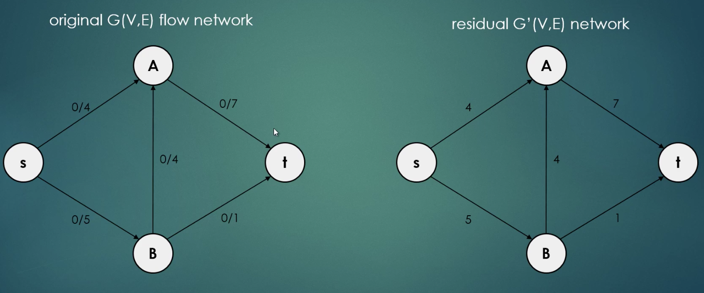

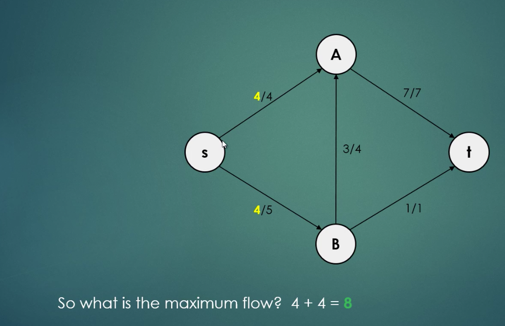

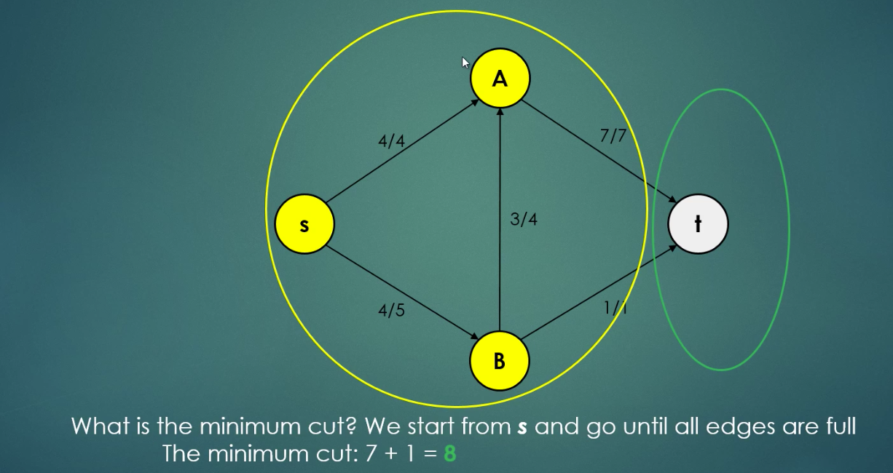
