# Shortest Path Algorithms
- Shorest path problem: finding a path between two vertices in a graph such that the sum of the weights of its edges is minimized.
- Dijkstra algorithm
- Bellman-Ford algorithm
- A* search
- Floyd-Warshall alogrithm

## Dijkstra Algorithm
- It was constructed by computer scientist <b>Edsger Dijstra in 1956</b>
- <b>Dijstra can handle positive edge weights !!! // Bellman-Ford algorithm can have negative weights as well</b>
- Several variants: it can find the shortest path from A to B, but it is able to construct a shortest path tree as well -> defines the shortest paths from a source to all the other nodes.
- This is asymptotically the fastest known single-source shortest-path algorithm for arbitrary directed graphs with unbounded non-negative weights

### <u>Dijstra algorithm</u>
- Dijkstra's algorithm time complexity: <b>O(V*logV + E)</b>
- Dijkstra's algorithm is a greedy one: it tries to find the global optimum with the help of local minimum -> it turns out to be good !!!
- It is greedy -> on every iteration we want to find the minimum distance to the next vertex possible -> appropriate data structures: <b>heaps (binary or Fibonacci)</b> or in general a <b>priority queue</b>

### Psedudocode
```ruby
class Node
  name
  min_distance
  Node predicessor

def DijkstraAlgorithm(Graph, source)
  distance[source] = 0
  create certex queue Q
      # Initialization phase: distance form source is 0, because that is the starting point. All the other nodes distances are infinity because we do not know the distances in advance
  for v in Graph
    distance[v] = inf
    predecessor[v] = undefined # precious node in the shortest path
    add v to Q
  while Q not empty
    u = vertex in Q with min distance # this is why to use heaps !!!
    remove v from Q

    for each neighbor v of u
      tempDist = distance[u] + distBetween(u,v)
      if tempDist < distance[v]
        distance[v] = tempDist
        predecessor[v] = u

  return distance[] # contains the shortest distances from source to other nodes
```

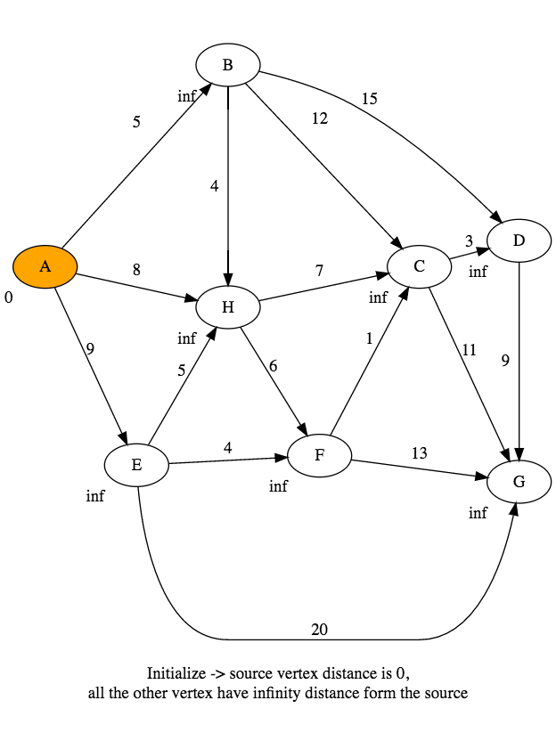


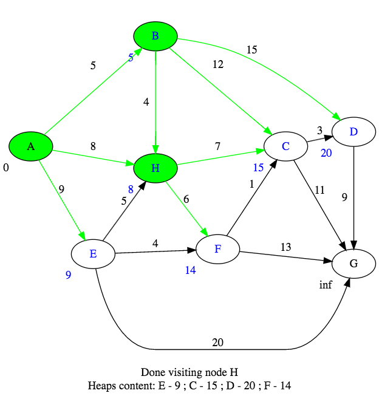
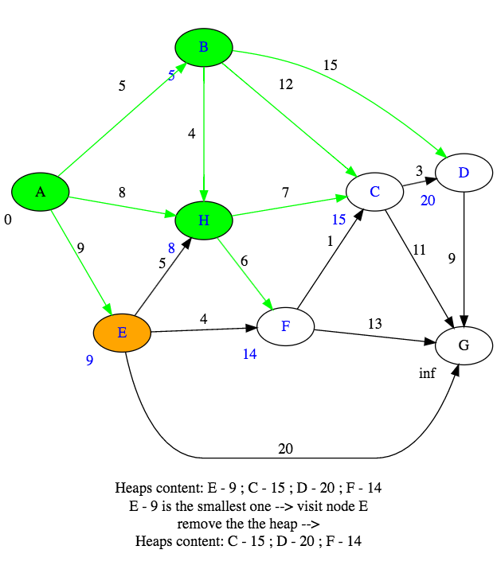
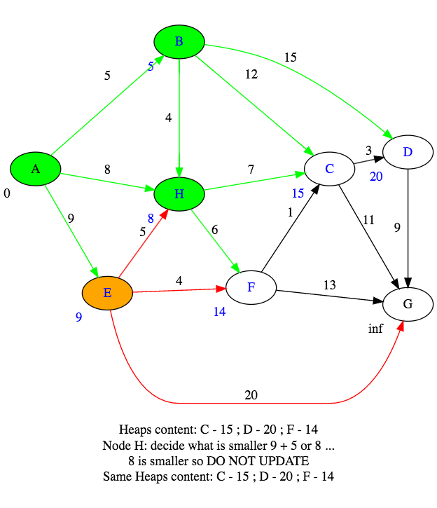
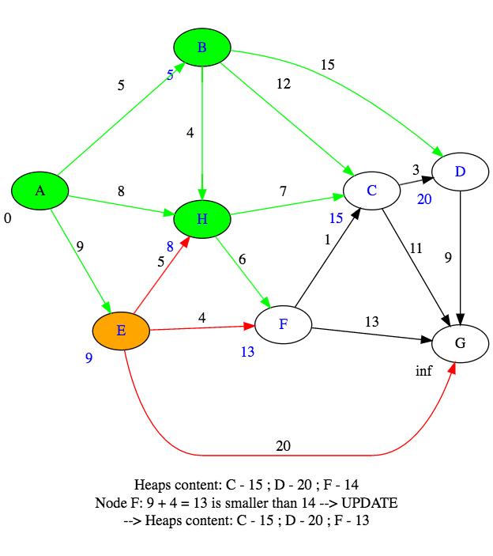
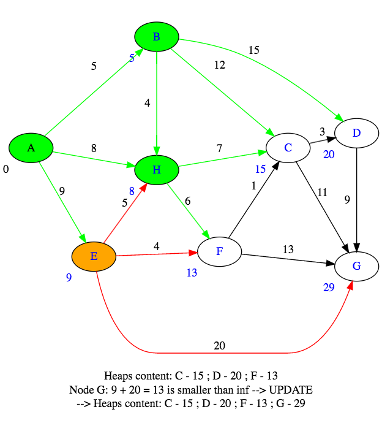


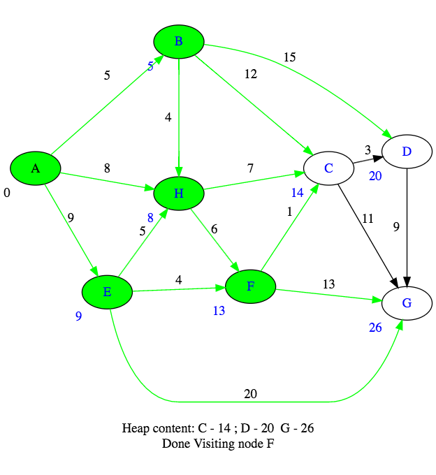
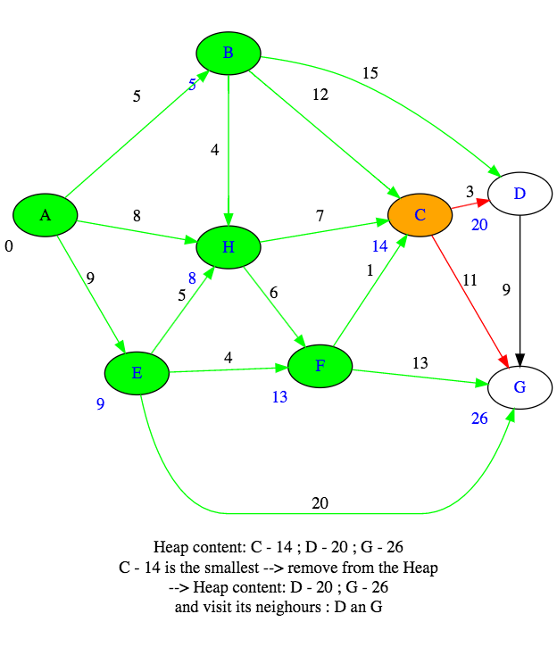

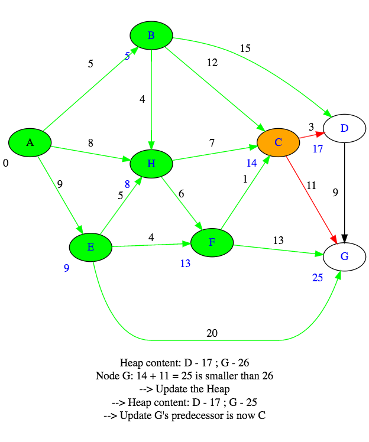

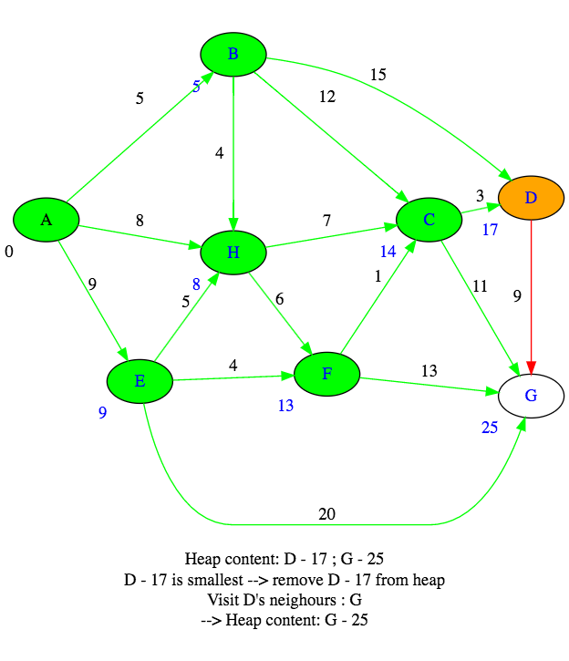

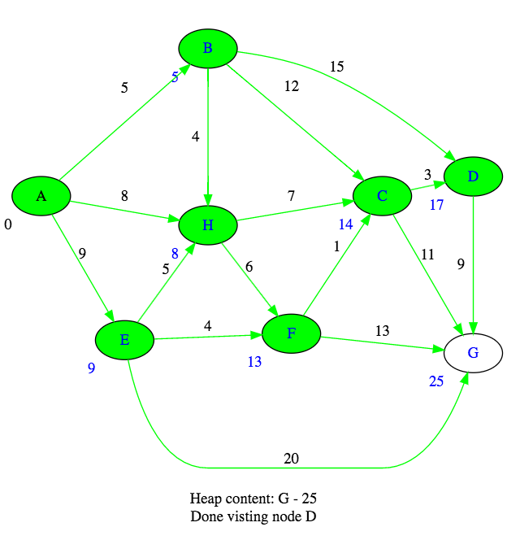
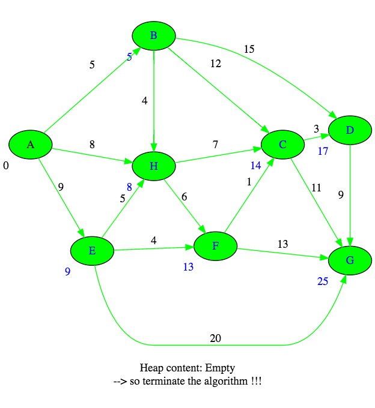
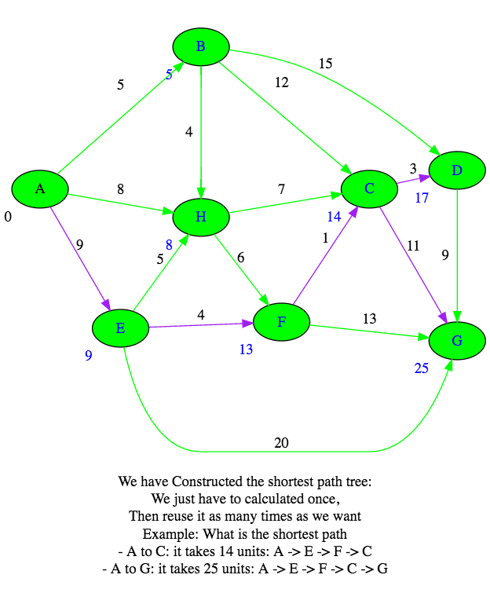
