# Spanning Trees

## Disjoint Set (Union-find data structure)
- Also known as union-find data structures
- Data structure to keep track of a set of elements partitioned into a number of disjoint (non overlapping) subsets
- Three main operations: **union** and **find** and **makeSet**
- Disjoint sets can be represented with the help of **linked lists** but usually we implemented as a tree like structure
- In **Kruskal algorithm (minimum-spanning-tree algorithm)** it will be useful: with disjoint sets we can decide in approximately **O(1)** time whether two vertices are in the same set or not

- So the make sets operation is quite easy to implement
- We set the parent of the given node to be itself
- Basically we create a distinct set to all the items/nodes

    ```ruby
      def makeSet(x)
        x.parent = x
    ```

- Serveral items can belong to the same set -> we ususally represent the set with one of its items:
  - **"Representative of the set"**
  - When we **search for an item** with **find()** then the operation is going to return with **the representative**
  ```ruby
    def find(x)
      if x.parent == x # Root node
        return x
      else
        return find(x.parent)
  ```

- Representative: 4
  - find(4) = 4
  - find(10) = 4
  - find(55) = 4


#### Union
- The union operation is **merge two disjoint sets** together by connecting them according to the representatives
  - PROBLEM: **this tree like structure can become unbalanced**

    ```ruby
      def union(x,y)
        xRoot = find(x)
        yRoot = find(y)

        xRoot.parent = yRoot
    ```
  - Fix:
    1. **Union by rank** -> always attach the smaller tree to the root of the larger one
        - the tree will become **more balanced: faster!!!**
    2. Path comperssion -> flattening the structure of hte tree
        - We set every visited node to be connected to the root directly!!!

- **Rank**
  - The rank of the set is equal to the rank of the representative// ~ the root node
  - We attack the smaller tree to the larger one -> it means we attack the tree with smallest rank to the tree with the highest rank!!!


#### Path Compression

```ruby
def find(x)
  if x.parent != x # not the representative
    x.parent = find(x.parent)
  return x.parent
```

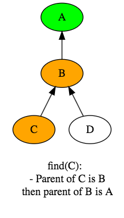


- Why is it good?
  - Because the next time, when I looking for the C, I can find it very easily and I can return the representative


- Why is it good?
  - The next time we want to **find( C ) or find(D)** it will take **O(1)** time
  - Because they are the direct neighbour of the representative !!!
    - The algorithm will be faster because of the **"path compression"**

#### <u>Applications</u>
- It is used motly in **Kruskal-algorithm** implementation
- We have to check whether adding a given edge to the **MST (minimum spanning tree)** would form a cycle or not
- For checking this -> union-find data structure is extremely helpful
- We can check whether a cycle is present -> in asymtotically **O(1)** constant time complexity !!!


#### Union-find data structure illustration


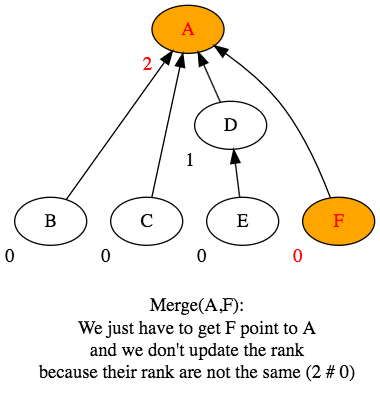


- **Because of the path compression -> All the nodes
will connect tot he representative directly.
Finding the representative takes O(1) for every node!!!)**


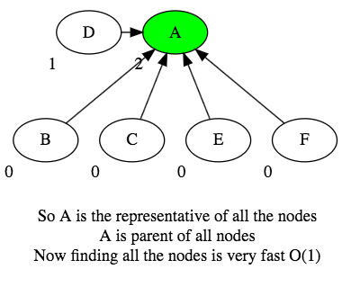


## Spanning Trees (Kruskal Algorithm)
- A spanning tree of an **undirected G graph** is a subgraph that includes all the vertices of **G**
- In general, a tree may have several spanning trees
- We can assign a weight to each edge
- A minimum spanning tree is then a spanning tree with weight less than or equal to the weight of every other spanning tree
- Has lots of applications: in big data analysis, clustering algorithms, finding minimum cost for a telecommumnications company laying cable to a new neighborhood
- Standard algorithms: **Prim's-Jarnik, Kruskal -> greddy algorithms**

- A graph may have several spanning tree
- usually we are looking for the minimum spanning tree: the spanning tree where the sum of edge weights is the lowest possible !!!

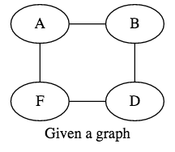

- <u>Spanning Tree:</u>


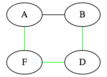


#### Kruskal-alogirthm
- We sort the edges according to their edge weights
- It can be done in **O(N * logN)** with mergesort or quicksort
- Union find data structure: **"disjoint set"**
  - We start adding edges to the MST and we want to make sure there will be no cycles in the spanning tree. It can be done in **O(log V)** with the help of union find data structure
    - We could use a heap instead sorting the edges in the beginning but the running time would be the same. So sometimes Krukal's algorithm is implemented with priority queues.

- Worst case running time: **O(E * logE)**, so we can use it for huge graphs too
- If the edges are sorted: the algorithm will be ** quasi-linear**
- If we multiply the weights with a constant or add a constant to the edge weights: the result will be the same
  - In physics, an invariant is a property of the system that remains unchanged under some transformation.
  - In Kruskal algorithm, spanning trees are invariant under the transformation of these weights (addition, multiplication)

- <u>Steps:</u>
  - **Given a graph with 7 vertices and 11 un-directed edges**

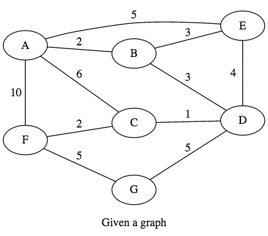


- **We have to sort the edges: 1,2,2,3,3,4,5,5,5,6,10**
- On every iteration we have to make sure whether by adding the new edge -> will there be a cycle or not ...
- <u>**Disjoint sets:**</u> at the beginning we have as many sets as the number of vertices. When adding an edge, we merge two sets together ...  **the algorithm stops when there is only a single set remains**


----

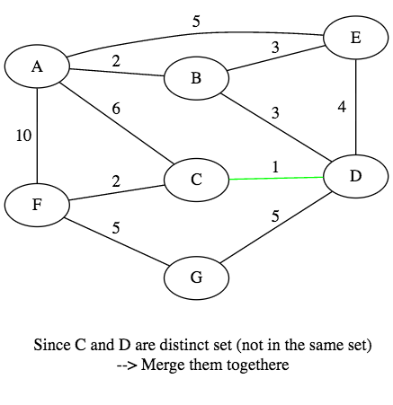


---

- **The edges: 1,[2],2,3,3,4,5,5,5,6,10**


------

- **The edges: 1,2,[2],3,3,4,5,5,5,6,10**

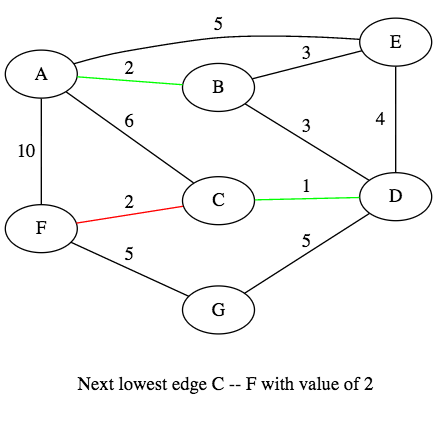


-----

- **The edges: 1,2,2,[3],3,4,5,5,5,6,10**

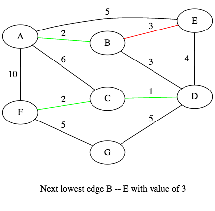


-----

- **The edges: 1,2,2,3,[3],4,5,5,5,6,10**


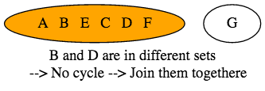


-----

- **The edges: 1,2,2,3,3,[4],5,5,5,6,10**

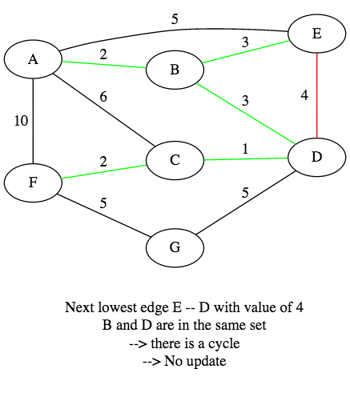


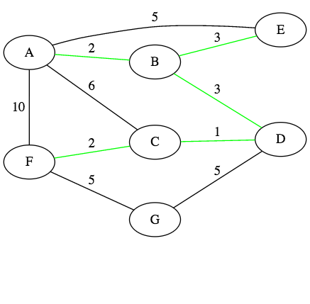


-----

- **The edges: 1,2,2,3,3,4,[5],5,5,6,10**


-----

- **The edges: 1,2,2,3,3,4,5,[5],5,6,10**

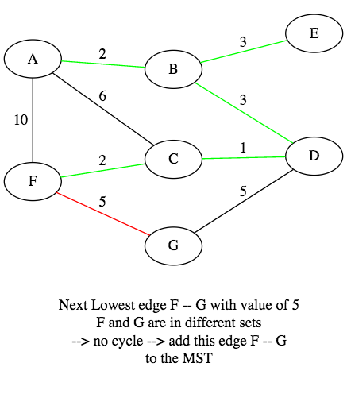

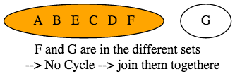

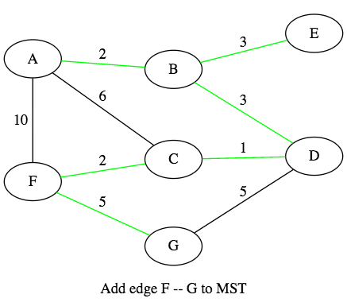


