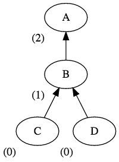
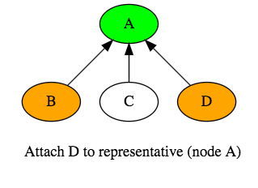
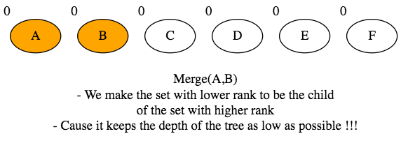
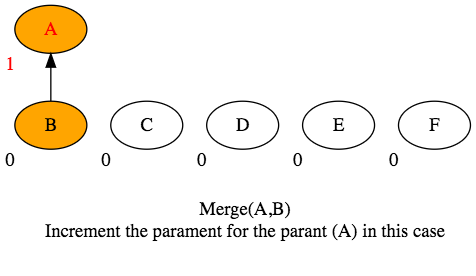
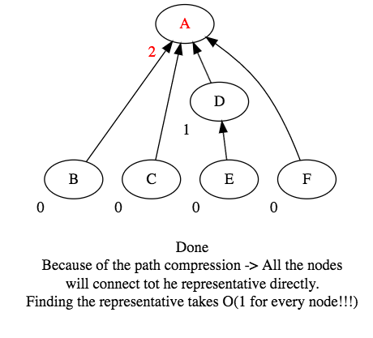

# Spanning Trees

## Disjoint Set (Union-find data structure)
- Also known as union-find data structures
- Data structure to keep track of a set of elements partitioned into a number of disjoint (non overlapping) subsets
- Three main operations: **union** and **find** and **makeSet**
- Disjoint sets can be represented with the help of **linked lists** but usually we implemented as a tree like structure
- In **Kruskal algorithm (minimum-spanning-tree algorithm)** it will be useful: with disjoint sets we can decide in approximately **O(1)** time whether two vertices are in the same set or not

- So the make sets operation is quite easy to implement
- We set the parent of the given node to be itself
- Basically we create a distinct set to all the items/nodes

    ```ruby
      def makeSet(x)
        x.parent = x
    ```

- Serveral items can belong to the same set -> we ususally represent the set with one of its items:
  - **"Representative of the set"**
  - When we **search for an item** with **find()** then the operation is going to return with **the representative**
  ```ruby
    def find(x)
      if x.parent == x # Root node
        return x
      else
        return find(x.parent)
  ```

- Representative: 4
  - find(4) = 4
  - find(10) = 4
  - find(55) = 4


#### Union
- The union operation is **merge two disjoint sets** together by connecting them according to the representatives
  - PROBLEM: **this tree like structure can become unbalanced**

    ```ruby
      def union(x,y)
        xRoot = find(x)
        yRoot = find(y)

        xRoot.parent = yRoot
    ```
  - Fix:
    1. **Union by rank** -> always attach the smaller tree to the root of the larger one
        - the tree will become **more balanced: faster!!!**
    2. Path comperssion -> flattening the structure of hte tree
        - We set every visited node to be connected to the root directly!!!

- **Rank**
  - The rank of the set is equal to the rank of the representative// ~ the root node
  - We attack the smaller tree to the larger one -> it means we attack the tree with smallest rank to the tree with the highest rank!!!





#### Path Compression

```ruby
def find(x)
  if x.parent != x # not the representative
    x.parent = find(x.parent)
  return x.parent
```


- Why is it good?
  - Because the next time, when I looking for the C, I can find it very easily and I can return the representative




- Why is it good?
  - The next time we want to **find( C ) or find(D)** it will take **O(1)** time
  - Because they are the direct neighbour of the representative !!!
    - The algorithm will be faster because of the **"path compression"**

#### <u>Applications</u>
- It is used motly in **Kruskal-algorithm** implementation
- We have to check whether adding a given edge to the **MST (minimum spanning tree)** would form a cycle or not
- For checking this -> union-find data structure is extremely helpful
- We can check whether a cycle is present -> in asymtotically **O(1)** constant time complexity !!!


#### Union-find data structure illustration










- **Because of the path compression -> All the nodes
will connect tot he representative directly.
Finding the representative takes O(1) for every node!!!)**


